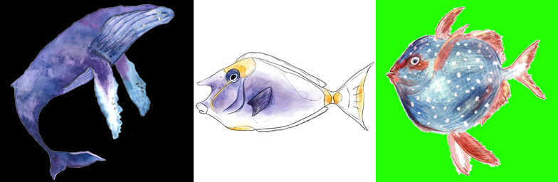

# pix2pix-edges-to-images

## Demo

## How to train a pix2pix(edges2xxx) model from scratch
- prepare data

## Prepare Data

### Use Photoshop to preprocessing

I created my own fish dataset I drew before https://www.instagram.com/fishchief/?hl=zh-tw. Most of my previous works are well-organised, I import them into photoshop and resize all images into 256x256 px then fit the image with one of three different colours of background to make the fish more obvious. My dataset resulting in 67 examples.

### Detect edges of all images
I upload all the images to my google drive, after mounting the colad with my drive, I started to detect edges of my images then combine them together. The script that I use to detect edges of images and for combination from one folder at once is here:
https://github.com/yining1023/pix2pix-tensorflow/blob/master/tools/edge-detection.py
(need to specify our own path on line 31), also need to create a new empty folder in dataset folder called "edges" in the same directory.

## Training Data

## Model Training

## Result

## Getting Start
