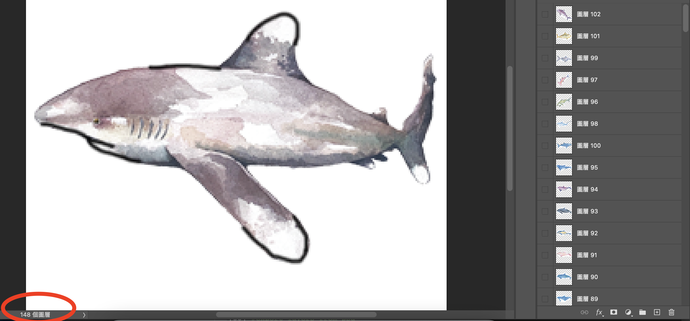
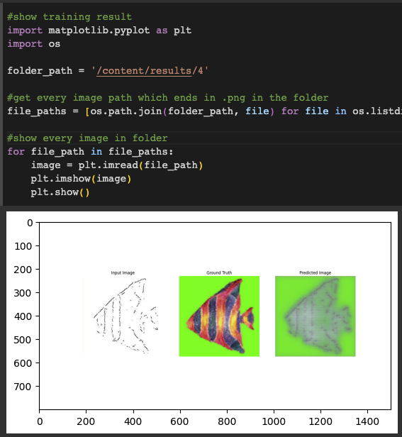

# pix2pix-edges-to-images

## Demo

## How to train a pix2pix(edges2fish) model from scratch
- prepare data
- Detect edges of all images
- Images combination

## Prepare Data

### prepare images using Photoshop
I use my drawing to created my own fish datase https://www.instagram.com/fishchief/?hl=zh-tw. Most of my previous works are well-organised, I import them into photoshop to do some basic adjustment such as remove the background, manually enhance edges, etc.


### Save each layers from PSD file

I imput all of the images into the same file, I have more than 148 layers, if I need to save them one by one will take too many times. So after adjusted all of them, I uploaded the psd file to Google Drive, running the code below to export every layers to target folder also on Google Drive.

```python
# export layers from psd
from psd_tools import PSDImage
from PIL import Image

# path to PSD file
psd = PSDImage.open('/content/drive/MyDrive/fishDataset/2306131706.psd')

# choose the output folder
output_folder = '/content/drive/MyDrive/fishDataset/png_folder'
os.makedirs(output_folder, exist_ok=True)

for index, layer in enumerate(psd):
    # use layer's name as file name
    layer_name = f'layer_{index}.png'
    output_path = os.path.join(output_folder, layer_name)

    # save as PNG file
    layer_image = layer.topil()
    layer_image.save(output_path, 'PNG')

    print(f'Saved layer {layer_name}')
``` 
(code provided by ChatGPT)

### Resize PNG images and save them as jpg into resized folder

Size of PNG files which has exported will suit the shape of the layer. The model I'm going to use only accept image which is 256*256px, so I need to resize them and also save them as jpg file so they don't have alpha channel. (Not sure if the model allow us to use PNG file🤔) JPG files will be exported to the file called "resized".
The directory structure is organized as follows:

```
Mydrive/
├── fishDataset/
│   └── file.psd/
│   └── png_folder/
│   └── resized_folder/
│   └── edges_folder/
│   └── combined_folder/
│       └── train_folder/
│       └── val_folder/
```

```python
import os
from PIL import Image

number_of_png = 122
png_path = "/content/drive/MyDrive/fishDataset/png_folder"
output_folder = "/content/drive/MyDrive/fishDataset/resized"
target_size = (256, 256)

def expand2square(pil_img, background_color):
    width, height = pil_img.size
    max_size = max(width, height)
    new_img = Image.new(pil_img.mode, (max_size, max_size), background_color)
    new_img.paste(pil_img, ((max_size - width) // 2, (max_size - height) // 2))
    return new_img

# Create the output folder if it doesn't exist
os.makedirs(output_folder, exist_ok=True)

for i in range(number_of_png):
    # Load the PNG image
    png_path = os.path.join(png_folder, f"layer_{i+1}.png")
    png = Image.open(png_path)
    #print()

    # Resize the image to the target size
    resized = expand2square(png, (255, 255, 255, 255)).resize(target_size)
    #resized = expand2square(png.resize(target_size), (255, 192, 203, 255))
    display(resized)

     # Create a new image with white background
    new_img = Image.new("RGB", target_size, (255, 255, 255))
    
    # Composite the resized image onto the new image while preserving transparency
    new_img.paste(resized, (0, 0), mask=resized.split()[3])

    # Convert and save as JPG
    jpg_path = os.path.join(output_folder, f"{i+1}.jpg")
    new_img.save(jpg_path)

    print(f"Processed image {i+1}/{number_of_png}")

print("Resizing complete!")
```
Reference: https://note.nkmk.me/en/python-pillow-add-margin-expand-canvas/

### Detect edges of all images and combination
I upload all the images to my google drive, after mounting the colad with my drive, I started to detect edges of my images then combine them together. The script that I use to detect edges of images and for combination from one folder at once is here:
https://github.com/yining1023/pix2pix-tensorflow/blob/master/tools/edge-detection.py
(need to specify our own path on line 31), also need to create a new empty folder in dataset folder called "edges" in the same directory.

### Images combination
```python
number_of_file = 122
folder = '/content/drive/MyDrive/fishDataset/combined'

for i in range(number_of_file):
  edges = np.array(Image.open(f'/content/drive/MyDrive/fishDataset/edges/{i+1}.jpg'))
  resized = np.array(Image.open(f'/content/drive/MyDrive/fishDataset/resized/{i+1}.jpg'))
  # (256,256,1)
  edges = tf.expand_dims(edges,2)
  edges = tf.concat([edges,edges,edges],2)
  img_combined = tf.concat([resized,edges], 1)
  img_pil = tf.keras.utils.array_to_img(img_combined)
  img_pil.save(f'{folder}/{i}.jpg')
```
This code snippet was written by Jasper, aime to combine input image and target image together

### randomly split combined image into train/ test folder
```python
import os
import random
import shutil

source_folder = "/content/drive/MyDrive/fishDataset/combined"  # Path to the source folder containing images
destination_folder_b = "/content/drive/MyDrive/fishDataset/combined/train"  # Path to the destination folder B
destination_folder_c = "/content/drive/MyDrive/fishDataset/combined/val"  # Path to the destination folder C
split_ratio = 0.8  # 80% for folder B, 20% for folder C

# Get the list of image files in the source folder
image_files = [f for f in os.listdir(source_folder) if os.path.isfile(os.path.join(source_folder, f))]

# Shuffle the image files randomly
random.shuffle(image_files)

# Split the image files based on the split ratio
split_index = int(len(image_files) * split_ratio)
files_for_folder_b = image_files[:split_index]
files_for_folder_c = image_files[split_index:]

# Move files to destination folder B
for file_name in files_for_folder_b:
    source_path = os.path.join(source_folder, file_name)
    destination_path = os.path.join(destination_folder_b, file_name)
    shutil.move(source_path, destination_path)

# Move files to destination folder C
for file_name in files_for_folder_c:
    source_path = os.path.join(source_folder, file_name)
    destination_path = os.path.join(destination_folder_c, file_name)
    shutil.move(source_path, destination_path)
```

## Model Training

Used the code in this link https://gitlab.cern.ch/smaddrel/pix2pix-tf_2_0/-/blob/master/pix2pix.py to train the model.
If you're using dataset fron online, paste the URL to line 16 and unzip it with line 18-20. But since I'm using my own dataset, I commanded both part of code and add my root path which is in my drive on line 22 (Don't forget to mount Drive!).

Then I create 2 sub folders in base folder, ```train``` and ```val```, and manually split images in dataset into these two folders.

To test if the model work, I changed the EPOCHS number from 200 into 3 in line 477, after running the code, it will automatically create a couple new sub-folders in content(content/results/0). By running following code:
```
import matplotlib.pyplot as plt
import os

folder_path = '/content/results/4'

file_paths = [os.path.join(folder_path, file) for file in os.listdir(folder_path) if file.endswith('.png')]

for file_path in file_paths:
    image = plt.imread(file_path)
    plt.imshow(image)
    plt.show()
```
(code was provided by ChatGPT), here's the result of epoch = 3<br>


Then I found I shouldn't use green or black in my target image unleast I want the background of predict images are not white.

## Result

Even the drawings were all drew by myself, but the style is to diverse, not sure if this is the reason

## Export the model

## Getting Start
